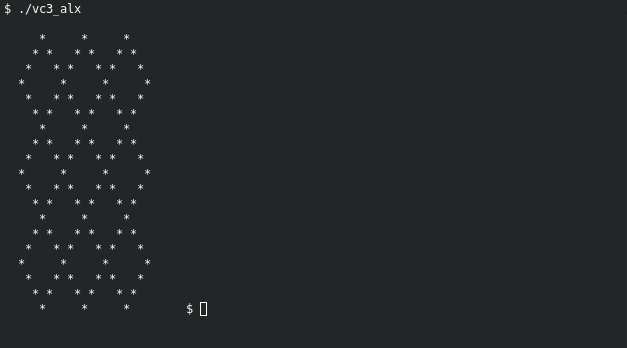

# VC3 '2023: Christmas Diamonds

125 bytes of Christmas Fun. My work for 
__[Vintage Computing Christmas Challenge 2023 (VC³ 2023)](https://logiker.com/Vintage-Computing-Christmas-Challenge-2023)__.

[](https://youtu.be/RGv2u6epVTY?si=gfbsXkw4JITLBSnn&t=1035)

After the break for 20 years of ZX-Spectrum assembler coding or so, I decided to make the first attempt of 'sizecoding'
for x86 architecture on assembler under Linux. Here is __125 bytes__ of __Christmas vibe__ for your enjoyment, where 36
bytes is a tiny [ELF header](https://en.wikipedia.org/wiki/Executable_and_Linkable_Format) (Executable and Linkable
Format), others __89 bytes are a machine code__. But actually 4 bytes from the header also used as register load. So 93 
bytes of CPU commands total. Placed at 118th of 228 in challenge results.

## Usage

Run a [binary](vc3_alx) with `./vc3_alx` command and fire-up a Christmas candles! :dizzy: :christmas_tree:

You can also install nasm and build them from code:

```bash
apt install nasm -y                                  # or yum, pacman, etc...
nasm -f bin -o vc3_alx main.asm; chmod +x vc3_alx    # compile them and set executable flag
./vc3_alx                                            # to run
wc -c vc3_alx                                        # to show total length of binary
```

This program used a mixed 32 and 16-bit CPU registry operations, syscalls and a few tricks. It also uses a very tiny 32
bit ELF-header to make this code possible to run under Linux systems. It was tested on a systems with a kernels versions
from 4.4.0 up to 5.10.0, but if one day something will be changed and this binary becomes not-runnable you can compile 
them with a larger ELF-header and some additional commands inside:

1. Set up a nonstant in [main.asm](main.asm) file for:
```nasm
compatibility_mode  equ     0
```
2. Compile and link them with an [ELF header](https://en.wikipedia.org/wiki/Executable_and_Linkable_Format):
```bash
nasm -f elf32 -o vc3_alx.o main.asm; ld -m elf_i386 compatibility_mode_binary vc3_alx.o
```

Of Course the size of a binary will be very high, but you'll get a maximum compatibility.

## URLs

- [youtube](https://www.youtube.com/watch?v=RGv2u6epVTY)
- [offical page](https://logiker.com/Vintage-Computing-Christmas-Challenge-2023)
- downloads at Scene.org (not uploaded yet)


